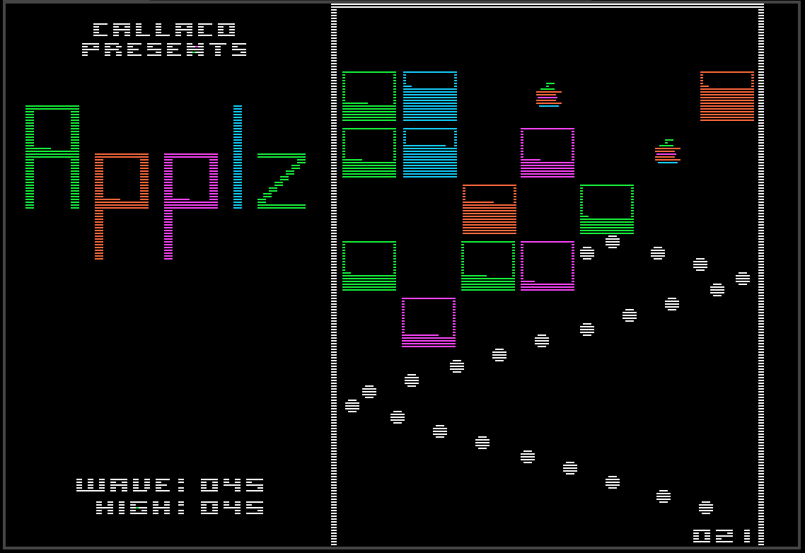

# Applz

Applz is remake/demake of the iPhone game Ballz.  It was written by Sean Callahan in 2022-2023 using VSCode with the RPW65 extension, the DASM assembler, and the yet-unreleased RPW debugger and emulator.

#### Instructions

* Aim apples left/right.
* Fire apples at blocks.
* Hit blocks enough times to remove them.
* Hit colored apples to accumulate more apples for the next wave.
* Don't allow blocks to reach the bottom of the screen.
* Survive to the highest wave you can.

#### Controls

* J - joystick control mode
* K - keyboard control mode
* Paddle 0 - aim and fire apples in joystick mode
* Left/Right arrows - aim apples in keyboard mode
* Apple/command key - with arrows, move left/right in larger steps
* SPACE/RETURN - fire apples in keyboard mode
* D - Cycle through difficulty levels (easy/normal/hard)
* S - Toggle sound on/off

Press and hold the fire button/key to speed up apple motion.

#### Development Notes

* The classic Apple II game Raster Blaster was the inspiration for the in-game ball/apple shape and color apple graphic, with a minor tweak to the stem shape.
* Apple drawing performance was greatly improved by using a technique also used by Raster Blaster.  Instead of XOR-ing a ball at its old position and then XOR-ing it again at its new position, a single image that is the combination of the two positions is XOR-ed in one operation.
* The name Callaco is an homage to Budgeco.
